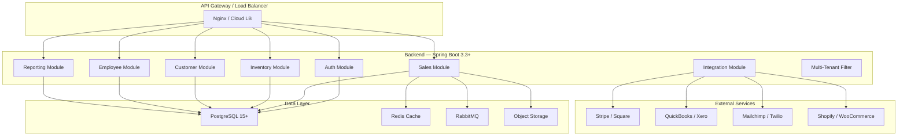
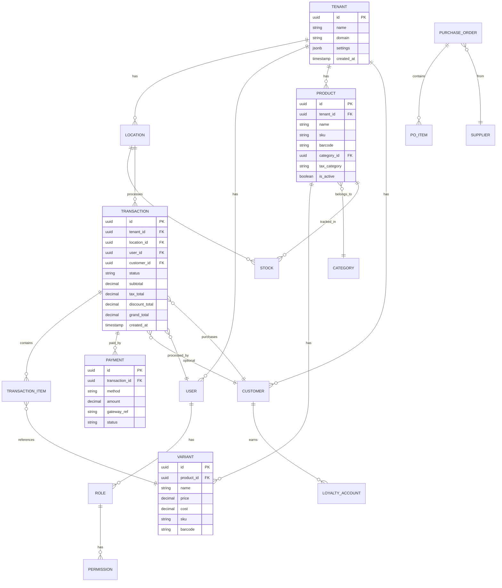

# Enterprise POS System — Implementation Plan

**Source**: [POS_System_User_Requirements.md](file:///d:/Lumora/POS%20System/POS_System_User_Requirements.md)

---

## 1. Requirements Analysis Summary

The document describes a **cloud-based SaaS POS product** (with optional on-premise) targeting retail and hospitality businesses. It is not a single-tenant internal tool—it is a **multi-tenant commercial product** sold to many businesses. The following plan focuses on the backend implementation using Spring Boot and PostgreSQL.

### Scope at a Glance

| Domain             | Key Capabilities                                                          | Complexity |
| ------------------ | ------------------------------------------------------------------------- | ---------- |
| **Sales**          | Cart, split-pay, tips, hold/recall, tax, receipts                         | 🔴 High    |
| **Inventory**      | SKU/variants, multi-location stock, PO, batch/lot/expiry, stock-take      | 🔴 High    |
| **Customers**      | CRM, loyalty (tiered, points), segmented marketing                        | 🟡 Medium  |
| **Employees**      | Time/attendance, performance, commission tracking                         | 🟡 Medium  |
| **Returns**        | Full/partial, exchange, manager approval, fraud flagging                  | 🟡 Medium  |
| **Reporting**      | Sales, inventory, financial, customer, employee — exportable/scheduled    | 🔴 High    |
| **Multi-Location** | Separate inventory, transfers, consolidated reports, per-location pricing | 🔴 High    |
| **Offline Mode**   | Local cache, pending-sync queue, conflict resolution                      | 🔴 High    |
| **Hardware**       | Receipt printer, barcode scanner, cash drawer, card terminal, KDS, scale  | 🟡 Medium  |
| **Integrations**   | Stripe/Square, QuickBooks/Xero, Shopify/Woo, Mailchimp/Twilio             | 🟡 Medium  |
| **Compliance**     | PCI DSS, GDPR, SOC 2, local tax regulations                               | 🔴 High    |

### Target Users & Roles (RBAC)

| Role                  | Core Access                                                                 |
| --------------------- | --------------------------------------------------------------------------- |
| **Administrator**     | Full system config, user/role management, all reports, integrations         |
| **Manager**           | Void/refund, inventory/pricing, discounts, employee schedules, reports      |
| **Cashier**           | Sales, payments, returns (w/ approval), customer lookup, clock in/out       |
| **Inventory Manager** | Products CRUD, stock levels, purchase orders, stock-take, inventory reports |

> [!NOTE]
> Permissions must be **granular and customizable** per-role, not hardcoded. The system should allow admins to create custom roles with fine-grained permissions.

---

## 2. Phased Delivery Roadmap

We break the system into **4 delivery phases**, each producing a deployable, testable product increment.

### Phase 1 — Core Foundation (Weeks 1–8)

> Goal: A working POS terminal that can sell products & take payments.

- Project scaffolding (Spring Boot + PostgreSQL + Docker)
- Authentication & Authorization (JWT, RBAC, multi-tenancy)
- Product Management (CRUD, categories, variants, images, bulk import)
- Sales Transaction Engine (cart logic, tax calc, discounts, payment processing)
- Receipt Engine (thermal print data, email/SMS)
- Basic Reporting (daily sales, end-of-day reconciliation)

### Phase 2 — Operations & Intelligence (Weeks 9–14)

> Goal: Full back-office operations with actionable insights.

- Inventory Management (stock tracking, reorder alerts, purchase orders, stock-take)
- Multi-Location Support (per-location inventory, transfers, consolidated views)
- Customer Management (CRM, customer groups, purchase history)
- Employee Management (profiles, time/attendance, performance tracking)
- Returns & Refunds (full/partial, exchanges, approval workflow)
- Comprehensive Reporting Suite (all report types, export, scheduling)

### Phase 3 — Engagement & Integrations (Weeks 15–20)

> Goal: External connectivity and customer engagement features.

- Loyalty Programs (points, tiers, redemption, expiration)
- Payment Gateway Integrations (Stripe, Square — API level)
- Accounting Integrations (QuickBooks, Xero — auto-sync)
- E-commerce Integrations (Shopify, WooCommerce — inventory sync)
- Marketing Integrations (Mailchimp, Twilio)
- Public REST API & Webhook System (OAuth 2.0, API keys, docs)

### Phase 4 — Enterprise Hardening (Weeks 21–26)

> Goal: Production-ready SaaS product with offline & compliance.

- Offline Sync Logic (Service-to-service, conflict resolution)
- Hardware Proxy Layer (Integration with print servers, scanners, etc. via API)
- Multi-Tenant SaaS Infrastructure (tenant isolation, custom domains)
- Security Hardening (PCI DSS controls, MFA, rate limiting, audit trails)
- Compliance (GDPR data export/deletion, SOC 2 evidence collection, tax reports)
- Performance Optimization (caching, connection pooling, read replicas, CDN)
- On-Premise Deployment Package (Docker Compose, installation docs)

---

## 3. Technical Architecture

### 3.1 System Architecture Diagram



### 3.2 Backend — Modular Monolith (Spring Boot)

We use a **modular monolith** (not microservices) for Phase 1–3. Each module has its own package with strict boundaries. Microservice extraction can happen later if scale demands it.

```
com.lumora.pos/
├── config/              # Spring Security, JWT, CORS, Flyway, Redis, RabbitMQ
├── common/              # Base entities, DTOs, exceptions, audit, pagination
├── tenant/              # TenantContext, TenantFilter, TenantInterceptor
├── auth/                # AuthController, AuthService, UserEntity, RoleEntity, PermissionEntity
├── product/             # ProductController, ProductService, ProductEntity, VariantEntity, CategoryEntity
├── inventory/           # StockController, StockService, StockEntity, PurchaseOrderEntity
├── sales/               # SaleController, SaleService, TransactionEntity, CartService, TaxService
├── payment/             # PaymentController, PaymentService, PaymentGatewayAdapter (Strategy pattern)
├── customer/            # CustomerController, CustomerService, LoyaltyService
├── employee/            # EmployeeController, EmployeeService, TimeClockService
├── returns/             # ReturnController, ReturnService, RefundService
├── reporting/           # ReportController, ReportService, ReportScheduler
├── integration/         # Adapter interfaces for Stripe, QuickBooks, Shopify, etc.
├── notification/        # EmailService, SmsService (Twilio), ReceiptService
└── location/            # LocationEntity, StockTransferService
```

> [!IMPORTANT]
> **Key Architectural Pattern**: Each module exposes **only its Service interface** to other modules. No module directly accesses another module's Repository. This enables future microservice extraction without rewriting business logic.

### 3.4 Database Schema — Core Entities (PostgreSQL)



> [!NOTE]
> Every table carries a `tenant_id` column. A Hibernate `@Filter` + Spring `TenantContext` (populated from JWT) ensures automatic scoping on every query. This is the **shared-database, discriminator-column** multi-tenancy model.

---

## 4. User Review Required

> [!IMPORTANT]
> **Multi-Tenancy Model**: The plan uses a **shared database with `tenant_id` discriminator columns**. This is optimal for SaaS cost-efficiency but means all tenant data lives in one database. If any client requires **physical data isolation** (separate databases), please flag this early as it changes the infrastructure significantly.

> [!CAUTION]
> **PCI DSS Compliance**: The requirements call for PCI DSS compliance. In practice, the safest approach is to **never handle raw card data**. We should use Stripe/Square's hosted payment elements (Stripe Elements, Square Web Payments SDK) so card numbers never touch our servers. This dramatically reduces PCI scope to **SAQ-A** level. Please confirm this approach.

> [!IMPORTANT]
> **Phasing Questions**:
>
> 1. Do you want to start with **Phase 1 (Core Foundation)** immediately?
> 2. Should I scaffold the full Spring Boot project structure now?
> 3. Any specific business type to prioritize first? (Retail vs. Restaurant — affects data models and features like tips)

---

## 5. Key Technical Decisions

| Decision         | Choice                   | Rationale                                                                           |
| ---------------- | ------------------------ | ----------------------------------------------------------------------------------- |
| Architecture     | Modular Monolith         | Simpler ops than microservices; modules have clean boundaries for future extraction |
| Multi-tenancy    | Shared DB + `tenant_id`  | Cost-effective SaaS; Hibernate `@Filter` auto-scopes queries                        |
| Auth             | JWT + Spring Security    | Stateless, scalable; PIN-based fast login for cashiers                              |
| Payment          | Stripe Elements (hosted) | PCI SAQ-A compliance; no raw card data on servers                                   |
| Offline          | REST Sync API            | Queue-based sync with conflict detection                                            |
| Caching          | Redis                    | Session cache, product catalog cache, rate limiting                                 |
| Async            | RabbitMQ                 | Receipt generation, report scheduling, sync processing                              |
| DB Migrations    | Flyway                   | Mature, Spring Boot native integration                                              |
| Containerization | Docker + Docker Compose  | Development parity; on-premise deployment support                                   |

---

## 6. Non-Functional Requirements Mapping

| NFR               | Target                 | Implementation Strategy                                                     |
| ----------------- | ---------------------- | --------------------------------------------------------------------------- |
| Transaction speed | < 2 seconds            | Redis product cache, optimized DB indexes, async receipt generation         |
| Search latency    | < 1 second             | PostgreSQL full-text search + GIN indexes on product name/SKU/barcode       |
| Concurrent users  | 50+ per location       | Connection pooling (HikariCP), stateless JWT, horizontal scaling            |
| DB query time     | < 500ms (P95)          | Proper indexing, query analysis, read replicas for reports                  |
| Peak load         | 10x normal             | Auto-scaling container orchestration, Redis caching, queue-based processing |
| Uptime            | 99.9%                  | Health checks, auto-restart, DB replication, CDN for static assets          |
| RTO / RPO         | 4h / 1h                | Automated backups, point-in-time recovery, geo-distributed backups          |
| Data retention    | 7 years (transactions) | Table partitioning by date, archival to cold storage                        |

---

## 7. Verification Plan

### Automated Tests

- **Unit Tests**: JUnit 5 + Mockito for all Service classes (tax calculation, discount logic, stock deduction)
- **Integration Tests**: `@SpringBootTest` with Testcontainers (PostgreSQL) for transaction workflows
- **API Tests**: MockMvc for all REST endpoints — auth, RBAC, CRUD, edge cases
- **Concurrency Tests**: Simulate concurrent stock deductions to verify no race conditions

### Manual Verification

- Multi-tenant isolation: login as tenant A, verify tenant B data is invisible
- API Endpoints: Verify all REST endpoints respond correctly to authorized requests.
- Stock Logic: Verify ACID compliance on high-frequency stock updates.
